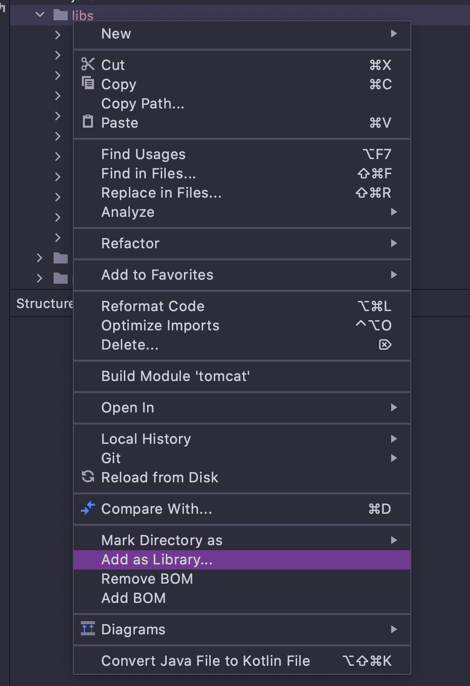

# 如何编译 TOMCAT 源码
1. 克隆tomcat 源码
```bash
git clone -b 9.0.44 https://github.com/apache/tomcat.git
```
2. 安装 [ant](https://dlcdn.apache.org//ant/binaries/apache-ant-1.10.12-bin.zip) 
```bash
wget -Ottps://dlcdn.apache.org//ant/binaries/apache-ant-1.10.12-bin.zip
sudo unzip ant.zip -d /usr/local/
export ANT_HOME=/usr/local/apache-ant-1.10.12
export PATH=$PATH:${ANT_HOME}/bin
```
3. 执行命令构建
```bash
ant deploy
# 使用eclipse 项目构建 用IDEA 打开 IDEA 的有坑不要趟
ant ide-eclipse
```
4.使用IDEA 打开项目找到 ant 加入 build 文件,没有ant 搜索 ant 安装


5.新建 tomcat 依赖包
```bash
mkdir libs
# 扫描 lib 目录 新建目录libs 复制执行目录的~/tomcat-build-libs所有jar 到lib
find ~/tomcat-build-libs -name "*.jar" | xargs -I{} cp {} libs
# 从ant 安装目录复制 ant.jar 放入libs 目录,并将libs目录add as library
 cp $ANT_HOME/lib/ant.jar libs
```
6. 将 libs 文件add-as-library
   
7. idea 打开项目试着运行一下 bootstrap 看是否有缺少包 注释掉测试文件的报错信息 
   * [TestStream.java](https://github.com/huyiyu/tomcat/blob/huyiyu/test/org/apache/coyote/http2/TestStream.java)
   * [TestCookieFilter.java](https://github.com/huyiyu/tomcat/blob/huyiyu/test/util/TestCookieFilter.java)
8. idea 配置 tomcat 干掉中文乱码的启动参数
   
```bash
-Duser.language=en_US
```
9. 将output 编译好的webapp 覆盖源码webapp
```bash
mv webapps webapps-backup
cp -r output/build/webapps webapps
```
10. [bootstrap](https://github.com/huyiyu/tomcat/blob/huyiyu/java/org/apache/catalina/startup/Bootstrap.java#L142) 静态代码块中添加主动初始化JSP代码
```java
try {
    Class<?> aClass = Class.forName("org.apache.jasper.servlet.JasperInitializer");
} catch (ClassNotFoundException e) {
    e.printStackTrace();
}
```